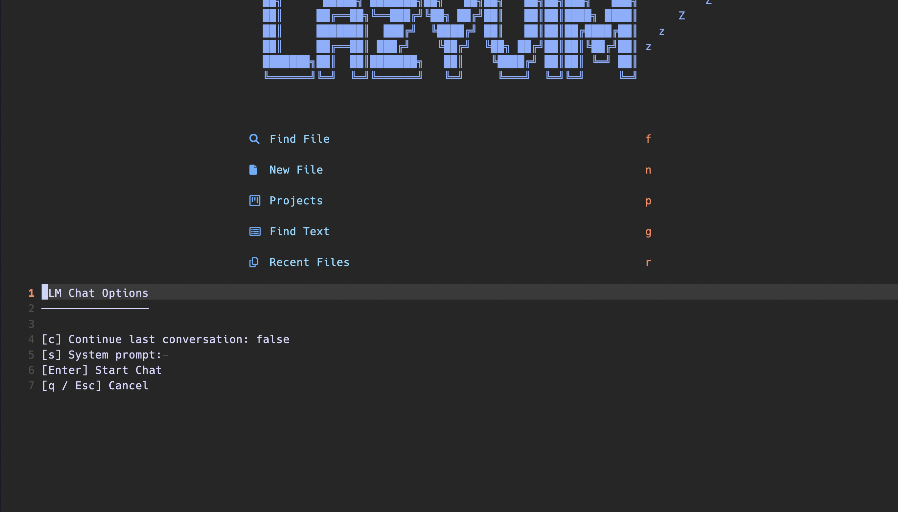
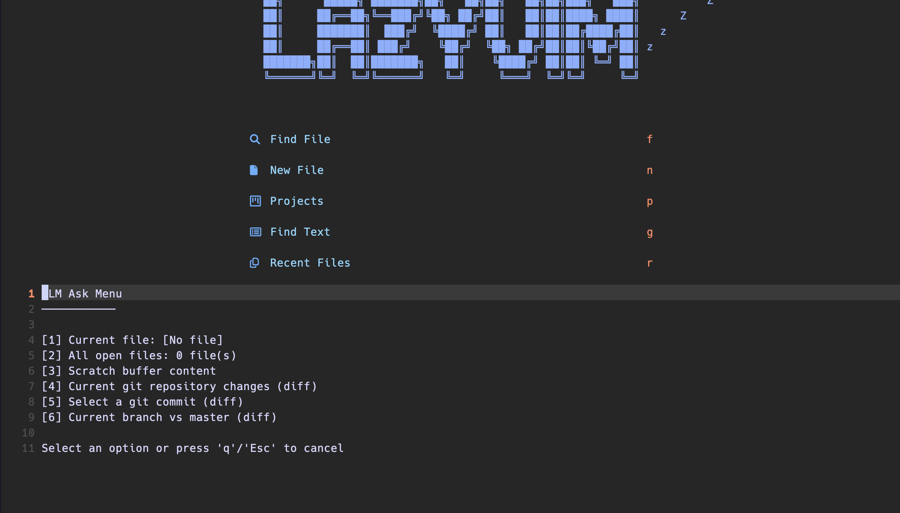

# llmnvim

# Overview

A neovim plugin built on top of [llm](https://llm.datasette.io/en/stable/)

For more on `llm`: https://simonwillison.net/tags/llm/


# Features

## Chat

Start a long-running conversation.



## Ask

Ask a one-off prompt and supply context via fragments


## Models

Manage available models


## Logs

Explore logged prompts and responses


# Installation

1. Install python (if applicable): https://docs.astral.sh/uv/getting-started/installation/

```sh
# MacOS
`curl -LsSf https://astral.sh/uv/install.sh | sh`
```

```sh
# Windows
`powershell -ExecutionPolicy ByPass -c "irm https://astral.sh/uv/install.ps1 | iex"`
```

2. Install llm: https://llm.datasette.io/en/stable/index.html#quick-start

```sh
uv tool install llm
```

3. Install llm-mlx plugin for MLX model support (if applicable): https://github.com/simonw/llm-mlx

```sh
llm install llm-mlx
```

4. Add `llmnvim` plugin to neovim:

```lua
return {
  "llmnvim",
  dir = "~/.config/nvim/lua/llmnvim",
  config = function()
    require("llmnvim").setup({
      no_stream = false,
      system_prompt = "You are a helpful assistant.",
      template = nil,
      float_opts = { border = "rounded", width = 80, height = 20, title = "LLM Chat" },
      key = nil, -- Set your API key here, e.g., "sk-..."
      continue_conversation = false,
      conversation_id = nil,
      params = {}, -- e.g., { var1 = "value1" }
      options = {}, -- e.g., { temperature = "0.7" }
    })
  end,
}
```

# Reference

**Commands**

- **`LLMAsk`**: Opens the LLM ask window, allowing you to interact with models and generate text.
- **`LLMChat`**: Opens the LLM chat window, enabling you to engage in conversations with models.
- **`LLMLogs`**: Opens the LLM log window, providing a way to analyze and review model logs.
- **`LLMSelectModel`**: Opens the LLM model selector window, allowing you to select the best model for your task.

**Keybindings**

- **`<leader>aa`**: Opens the LLM ask window.
- **`<leader>ac`**: Opens the LLM chat window.
- **`<leader>al`**: Opens the LLM log window.
- **`<leader>am`**: Opens the LLM model selector window.
- **`<leader>lf`**: Opens the LLM fragment window.

**TODO**

## Essentials

[x] chat: interactive prompt (right-side sidebar0
[x] models: list/select models (floating buffer)
[x] ask: one-shot question on files (open, glob, search, etc.) (floating buffer

- [x] file
- [x] files
- [x] keybindings
      [x] logs: view logs

## V1.1

- [ ] upgraded ask:

  - [x] scratch
  - [x] git - staged,unstaged,untracked
  - [x] git - commit
  - [x] git - branch vs master
  - [ ] selected cursor
  - [ ] no file, just regular prompt
  - [ ] all files in current directory
  - [ ] all files in root directory
  - [ ] search for files using snacks/telescope

- [ ] keybindings / keybindings ui
  - [x] ask keybindings
  - [ ] ask keybindings ui
  - [ ] chat keybindings
  - [ ] chat keybindings ui
  - [ ] models keybindings ui

## Planned upgrades

### Expanded LLM CLI Usage

- [x] prompt Execute a prompt
- [x] chat Hold an ongoing chat with a model.
- [x] logs Tools for exploring logged prompts and responses
- [x] models Manage available models
- [ ] collections View and manage collections of embeddings
- [ ] embed Embed text and store or return the result
- [ ] embed-models Manage available embedding models
- [ ] embed-multi Store embeddings for multiple strings at once in the...
- [ ] fragments Manage fragments that are stored in the database
- [ ] similar Return top N similar IDs from a collection using cosine...
- [ ] templates Manage stored prompt templates
- [ ] schema Manage I/O format
- [ ] tool Manage tool calls

### LLM Plugins

- [ ] Embeddings via https://github.com/simonw/llm-embed-jina
-

### Cursor-like Features

- [ ] Expand ask to entire codebase - use embeddings?
- [ ] Inline code writing / suggestions

###
